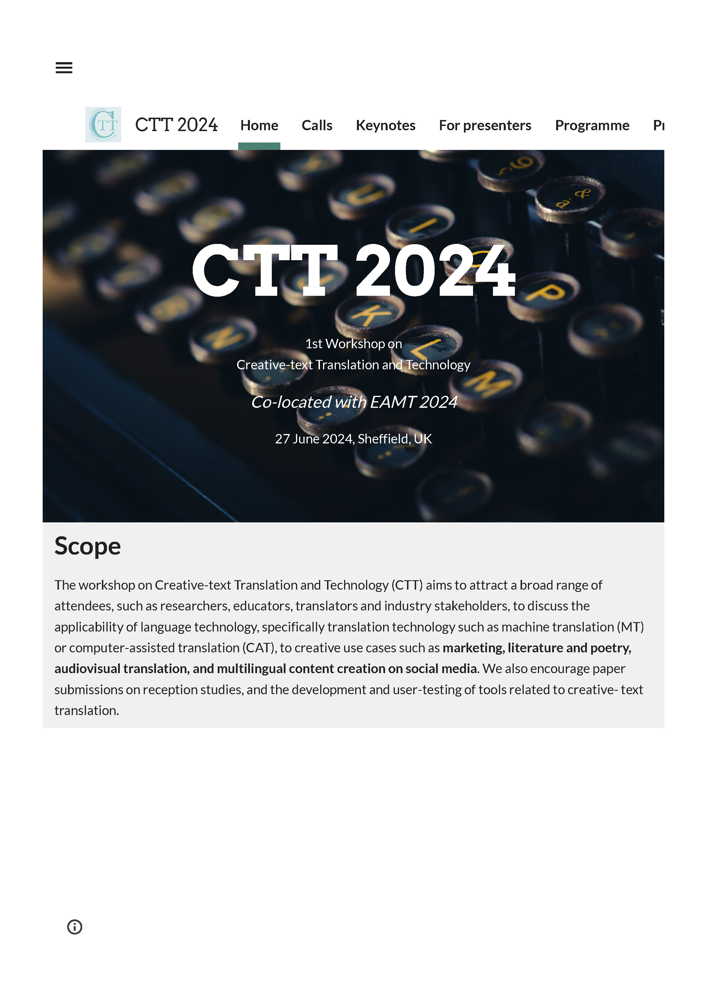
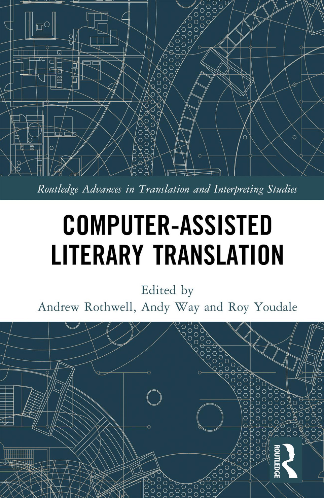
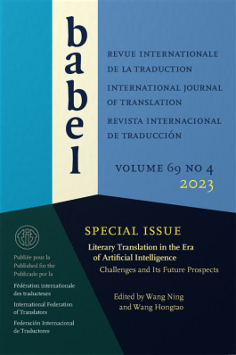
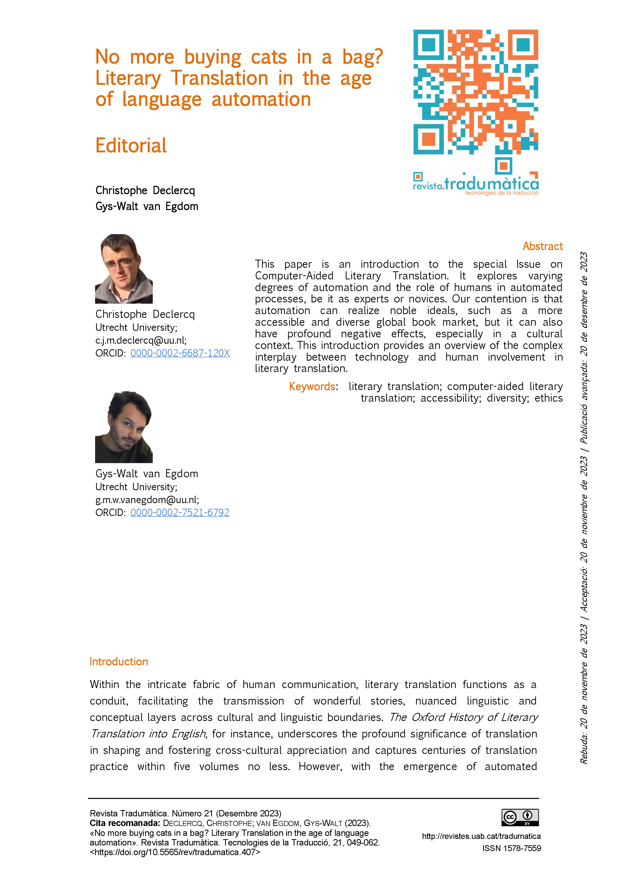
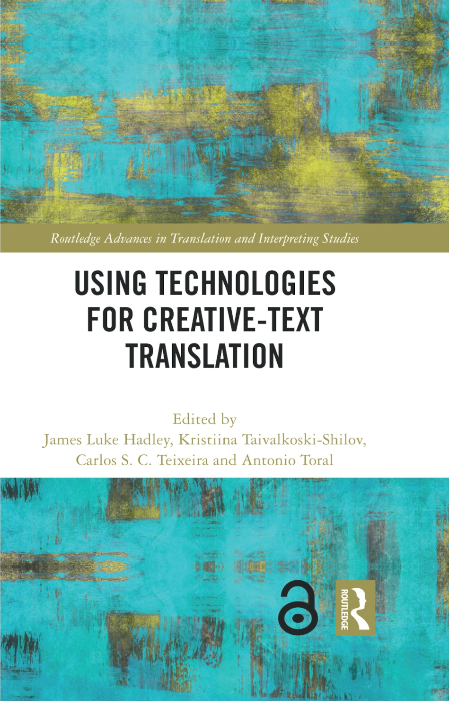
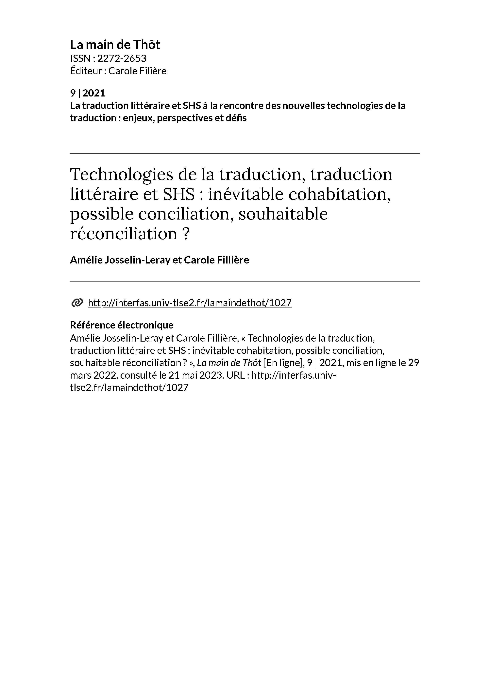
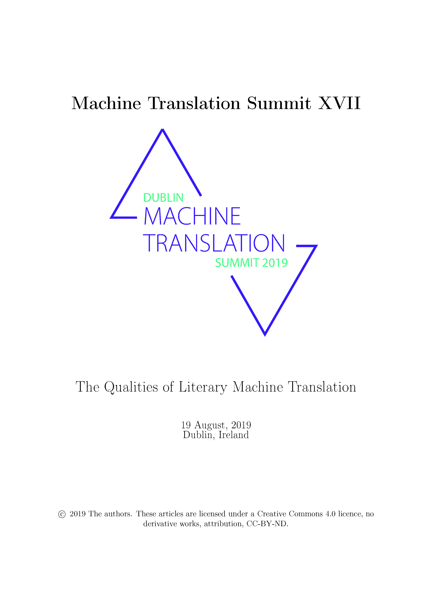

<a href="https://ctttn.github.io/resources.html#podcasts" class="green">Podcasts</a> | <a href="https://ctttn.github.io/resources.html#issues" class="green">Special Issues</a> | <a href="https://ctttn.github.io/resources.html#press" class="green">Press Coverage</a> | <a href="https://ctttn.github.io/resources.html#opinions" class="green">Opinions</a> | <a href="https://ctttn.github.io/resources.html#initiatives" class="green">Other Initiatives</a> | <a href="https://ctttn.github.io/resources.html#tools" class="green">Tools</a>

<h2 id="podcasts">Podcasts</h2>

### The Visible Art of Translation (EN)

These series of podcasts are part of the EU-funded INCREC project at the University of Groningen. Our focus is creativity, translation and technology in literary and audiovisual translation. Our goal is to give visibility to the often invisible skills, role and voice of professional translators.

<iframe style="border-radius:12px" src="https://open.spotify.com/embed/show/2Xk77k65qkcFhV6eI4ts8F?utm_source=generator&theme=0" width="100%" height="152" frameBorder="0" allowfullscreen="" allow="autoplay; clipboard-write; encrypted-media; fullscreen; picture-in-picture" loading="lazy"></iframe>

### Lost in Translation, special episode on AI (FR)

Podcast hosted Clara Joubert, PhD student in translation studies, in which each episode features a different translator, interpreter or researcher talking about translation in all its complexity and diversity. See, also, this <a href="https://open.spotify.com/episode/07mfd7MYH2F0m2mOOISgop?si=904340ad27234714" target="_blank" class="green">episode on literary machine translation</a>.

<iframe style="border-radius:12px" src="https://open.spotify.com/embed/episode/3UTIPjkoytvNThRes5gmlf?utm_source=generator&theme=0" width="100%" height="152" frameBorder="0" allowfullscreen="" allow="autoplay; clipboard-write; encrypted-media; fullscreen; picture-in-picture" loading="lazy"></iframe>

<h2 id="issues">Special Issues</h2>

  

    <a href="https://ctt2024.ccl.kuleuven.be/home" target="_blank">
      
      

🇬🇧

    </a>
  

  

    <a href="https://doi.org/10.4324/9781003357391" target="_blank">
      
      

🇬🇧

    </a>
  

  

    <a href="https://doi.org/10.1075/babel.69.4" target="_blank">
      
      

🇬🇧

    </a>
  

  

    <a href="https://revistes.uab.cat/tradumatica/issue/view/n21" target="_blank">
      
      

🇬🇧 🇪🇸

    </a>
  

  

    <a href="https://doi.org/10.4324/9781003094159" target="_blank">
      
      

🇬🇧

    </a>
  

  

    <a href="https://interfas.univ-tlse2.fr/lamaindethot/899" target="_blank">
      
      

🇫🇷

    </a>
  

  

    <a href="https://aclanthology.org/volumes/W19-73/" target="_blank">
      
      

🇬🇧

    </a>
  

<h2 id="press">Press Coverage</h2>

Le Monde, "<a href="https://www.lemonde.fr/idees/article/2024/10/20/traduction-par-ia-les-algorithmes-generatifs-produisent-non-pas-du-langage-mais-une-langue-simulee_6356421_3232.html" target="_blank" class="green">Traduction par IA&nbsp;: Les algorithmes génératifs produisent non pas du langage, mais une langue simulée</a>" (FR)

Le Monde, "<a href="https://www.lemonde.fr/economie/article/2024/02/02/les-traducteurs-litteraires-victimes-de-l-intelligence-artificielle_6214361_3234.html" target="_blank" class="green">Les traducteurs littéraires victimes de l'intelligence artificielle</a>" (FR)

<h2 id="opinions">Opinions</h2>

CEATL *et al*., "<a href="https://europeanwriterscouncil.eu/240425_cwos_jointstatement_ai-act/" target="_blank" class="green">Joint Statement on Generative Artificial Intelligence and the EU AI Act</a>" (EN)

A&#42;dS, IGÜ &amp; VdÜ, "<a href="https://literaturuebersetzer.de/aktuelles/offener-brief-ki/" target="_blank" class="green">Offener Brief der deutschsprachigen Übersetzer&#42;innenverbände zur KI-Verordnung</a>" (DE)

En chair et en os, "<a href="https://enchairetenos.org/" target="_blank" class="green">Littérature, cinéma, presse, jeux vidéo&nbsp;: non à des traductions sans âme</a>" (FR, AR, DE, EL, EN, ES, EU, HE, IT, PL, PT, RO, RU, SL, SR, SV, TR)

ATLAS &amp; ATLF, "<a href="https://www.atlas-citl.org/tribune-ia/" target="_blank" class="green">IA et traduction littéraire&nbsp;: les traductrices et traducteurs exigent la transparence</a>" (FR, EN, ES, IT, TR, CS, PT)

AVTE, "<a href="https://avteurope.eu/2021/09/13/press-release-avte-manifesto-on-machine-translation/" target="_blank" class="green">Machine Translation Manifesto</a>" (EN)

<h2 id="initiatives">Other Intiatives</h2>

<a href="https://kollektive-intelligenz.de/" target="_blank" class="green">Kollektive Intelligenz</a> (DE)

<a href="https://www.atlas-citl.org/lobservatoire-de-la-traduction-automatique/" target="_blank" class="green">L'Observatoire de la Traduction Automatique</a> (FR)

<h2 id="tools">Tools</h2>

Oliver, Antoni and Sergi Alvarez-Vidal. '<a href="https://aclanthology.org/2024.ctt-1.3/" target="_blank" class="green">LitPC: A set of tools for building parallel corpora from literary works</a>.' *Proceedings of the First Workshop on Creative-text Translation and Technology*, edited by Bram Vanroy *et al*., EAMT, 2024, pp. 21--31. (<a href="https://github.com/aoliverg/litpc" target="_blank" class="green">Link to GitHub repository</a>)

Bikić-Carić, Gorana, Bojana Mikelenić and Metka Bezlaj. '<a href="http://journal.sepln.org/sepln/ojs/ojs/index.php/pln/article/view/6482" target="_blank" class="green">Construcción del RomCro, un corpus paralelo multilingüe</a>.' *Procesamiento del Lenguaje Natural*, vol. 70, SEPLN, 2023, pp. 99--110. (<a href="https://elrc-share.eu/repository/browse/romance-croatian-parallel-corpus/a252399e71be11ed9c1a00155d026706a8dce436b50d49adaffabdaee111e500/" target="_blank" class="green">Link to ELRC repository</a>)

Oliver, Antoni and Bojana Mikelenić. '<a href="https://aclanthology.org/2020.lrec-1.869/" target="_blank" class="green">ReSiPC: a Tool for Complex Searches in Parallel Corpora</a>.' *Proceedings of the 12th Language Resources and Evaluation Conference*, edited by Nicoletta Calzolari *et al*, LREC, 2020, pp. 11--16. (<a href="https://github.com/aoliverg/ReSiPC" target="_blank" class="green">Link to GitHub repository</a>)
